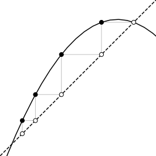

# `dyna-pi`: Dynamic Program Improvement



The **dynamic program improvement system** (`dyna-pi`) is an interactive tool for
analyzing and improving dynamic programming algorithms.  We developed this tool
because Finding a correct program with the optimal asymptotic runtime can be
unintuitive, time-consuming, and error-prone.  `dyna-pi` aims to automate this
laborious process.

**Key features**:

1) **Dyna language**: A high-level, domain-specific language for clear and concise dynamic program specification.
2) **Efficient solvers**: General-purpose solvers to execute Dyna programs, including agenda-based fixpoint iteration and semiring Newton's method.
3) **Static analysis**: Type analysis and worst-case time/space complexity analyses.
4) **Program transformations**: Meaning-preserving Dyna-to-Dyna transformations, which systematizes the repeated insights of numerous authors when speeding up algorithms.
5) **Optimizer**: A search algorithm for identifying a sequence of transformations that reduce the runtime complexity given an initial, correct program.
6) **Visualization and debugging**: Tools to aid in the development of correct programs, including integration with Jupyter.

The `dyna-pi` system is based on [Tim Vieira](http://timvieira.github.io)'s 2023
[PhD dissertation](http://timvieira.github.io/doc/2023-timv-dissertation.pdf)
(see also defense [video](https://youtu.be/SUOvgaxFxP4) and
[slides](https://docs.google.com/presentation/d/10LTArMtqI3nc0xnBkq_m7b7Qk312PL4Vb_26q6fA6QU/edit?usp=sharing)).
It is also part of the broader [Dyna project](https://dyna.org/).


**Notice.**  This code release is in its early stages and might have some rough edges.
We welcome feedback and contributions through pull requests, email, and our [issue tracker](http://github.com/timvieira/dyna-pi/issues).


## Quick Start

For a quick start, check out our [demo notebook](docs/Demo.ipynb) [](https://colab.research.google.com/github/timvieira/dyna-pi/blob/main/docs/Demo.ipynb) for an overview and basic usage instructions.


## Installation

To install `dyna-pi` using `pip` run:
```
pip install -U "git+https://github.com/timvieira/dyna-pi"
```

## License

This project is licensed under the MIT License - see the [LICENSE](LICENSE.md) file for details.


## References

For more information about `dyna-pi` please refer to:

- [Automating the Analysis and Improvement of Dynamic Programming Algorithms with Applications to Natural Language Processing](http://timvieira.github.io/doc/2023-timv-dissertation.pdf).
  Tim Vieira.
  PhD Dissertation. Johns Hopkins University. 2023

- [Searching for More Efficient Dynamic Programs](https://aclanthology.org/2021.findings-emnlp.322/).
  Tim Vieira, Ryan Cotterell, and Jason Eisner.
  Findings of EMNLP. 2021
